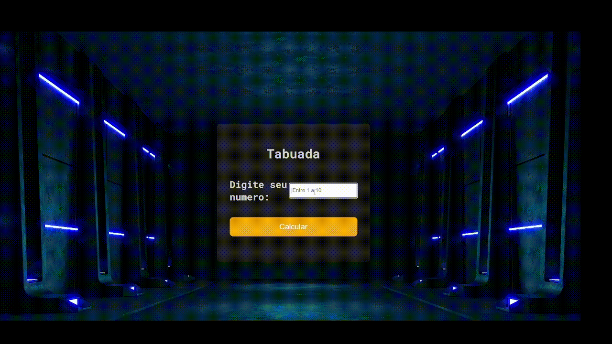

### 💻Table

Project that captures the input event on your screen and shows table of the number below, is a useful tool to help people learn how to multiply numbers. It's basically a set of equations that show the results of multiplications number by other numbers.

- Logic and Algorithms with Javascript;
- Mobile version and responsiveness;
- DOM manipulation;
- Function return;
- Work with colors and fonts;
- Align and position text and elements;
- Application of spacing;
- Use CSS variables to manipulate the color palette and font size of the project;
- Structure of the project's file system separated by folder;
  
 

<h1 align="center">
	
	</h1>
	

## 🧪 Tools

Application developed using the following tools:

- [HTML5](https://www.w3schools.com/html/default.asp)
- [CSS3](https://www.w3schools.com/css/default.asp)
- [Javascript](https://developer.mozilla.org/en-US/docs/Web/JavaScript)

### Programs needed to get started

- [ Live Server ](https://marketplace.visualstudio.com/items?itemName=ritwickdey.LiveServer)
- [Visual Studio Code - Vscode](https://code.visualstudio.com/)

 

Made  by Agnelo Neto 

- [LINKEDIN](https://www.linkedin.com/in/agneloneto) - https://www.linkedin.com/in/agneloneto/
